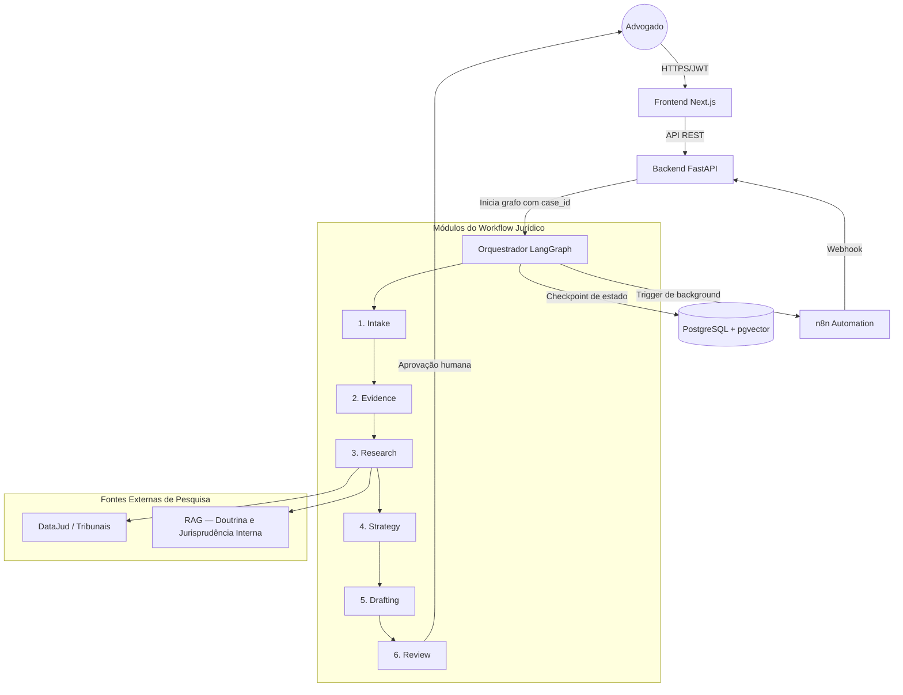

# Arquitetura do Sistema — Squad Digital (SaaS)

## 1. Visão Geral

O sistema é uma plataforma multi-tenant baseada em agentes de IA orquestrados para
automação de fluxos jurídicos complexos. A arquitetura prioriza isolamento de dados
(multitenancy), auditoria completa e a filosofia Human-in-the-Loop.

O produto é um copiloto jurídico — nunca um sistema autônomo. Todo output gerado por
IA é um rascunho que requer aprovação explícita de um advogado antes de qualquer uso.

---

## 2. Diagrama de Fluxo de Dados



---

## 3. Componentes Centrais

### 3.1 Frontend (Next.js 14+)

- Interface do advogado para abertura de casos, upload de documentos e revisão de drafts
- Comunicação exclusivamente via API REST com o backend
- Nunca acessa o orquestrador ou o n8n diretamente
- Autenticação via JWT armazenado em cookie HttpOnly

### 3.2 Backend (FastAPI)

- Gerencia usuários, autenticação, upload de arquivos e roteamento de requests
- Middleware injeta tenant_id em cada request a partir do JWT
- Inicia e monitora os grafos LangGraph via chamadas internas
- Expõe endpoints de aprovação humana que desbloqueiam o grafo suspenso

### 3.3 Orquestrador (LangGraph)

- Motor central de orquestração dos 6 módulos de agentes
- Mantém o CaseState como objeto tipado e persistido em cada transição
- Suporta suspensão nativa do grafo para aguardar aprovação humana
- Cada nó registra entrada no audit_log antes de retornar

Ciclo de vida de um caso:

```
1. Backend inicia o grafo com case_id e tenant_id
2. LangGraph recupera o último checkpoint do banco
3. Cada nó executa, registra auditoria e atualiza o CaseState
4. Se human_approval_required = True, o grafo entra em SUSPENDED
5. Advogado revisa e aprova via frontend
6. Backend retoma o grafo a partir do checkpoint salvo
7. Grafo avança para o próximo módulo
```

### 3.4 Automação (n8n)

Utilizado exclusivamente para tarefas de background que não exigem raciocínio do LLM:

- OCR de documentos pesados (PDFs escaneados)
- Verificação de status de processos em portais de tribunais
- Disparo de notificações e e-mails para o advogado
- Integração com sistemas legados dos escritórios (Projuris, CPJ)

O n8n nunca é exposto ao frontend. Toda comunicação é via webhook interno.

### 3.5 Banco de Dados (PostgreSQL 16 + pgvector)

- Armazena casos, evidências, fontes jurídicas, audit logs e checkpoints do LangGraph
- pgvector habilita busca semântica para o módulo de pesquisa jurídica (RAG)
- Row Level Security (RLS) como segunda camada de isolamento de tenant
- Migrations gerenciadas via Alembic

---

## 4. Estratégia de Multitenancy

O sistema usa isolamento lógico via chave estrangeira com RLS como reforço.

### Nível de aplicação

- Middleware do FastAPI extrai tenant_id do JWT em cada request
- tenant_id é injetado no contexto da request e propagado para todos os serviços
- Nenhuma query ao banco é executada sem filtro de tenant_id

### Nível de banco de dados

Toda tabela possui a coluna tenant_id UUID NOT NULL.
RLS é habilitado em todas as tabelas com a seguinte política padrão:

```sql
ALTER TABLE cases ENABLE ROW LEVEL SECURITY;

CREATE POLICY tenant_isolation ON cases
  USING (tenant_id = current_setting('app.current_tenant')::uuid);
```

O backend define a variável de sessão antes de cada query:

```sql
SET app.current_tenant = '<tenant_id>';
```

### Isolamento do RAG

A busca vetorial (pgvector) também é filtrada por tenant_id.
Teses jurídicas de um escritório nunca aparecem na busca de outro.

---

## 5. Módulos do Workflow Jurídico

### Módulo 1 — Intake & Routing

Agentes: Coordenador Digital + Triagem Digital

- Classifica a plataforma envolvida (Meta, Shopee, Mercado Livre, WhatsApp, etc.)
- Identifica a modalidade do golpe (PIX, Marketplace, Falso Advogado, etc.)
- Define urgência e necessidade de tutela de urgência
- Verifica indício de múltiplas vítimas (candidato a ação coletiva)
- Lista documentos necessários para o caso

### Módulo 2 — Evidence Matrix

Agentes: Análise de Provas Digitais + Especialista Digital

- Processa prints de conversas, comprovantes de pagamento e perfis falsos
- Classifica cada evidência por tipo, relevância e uso jurídico
- Extrai texto de imagens via OCR (delegado ao n8n para arquivos pesados)
- Gera inventário estruturado de provas para uso nos módulos seguintes

### Módulo 3 — Legal Research (Hybrid RAG)

Agentes: Pesquisa Legislativa + Jurisprudência + Doutrina

- Busca legislação aplicável: CDC, Marco Civil, LGPD, Lei 14.155/21, CP
- Pesquisa jurisprudência em TJSP, TJRJ, STJ e TRFs via DataJud
- Consulta doutrina indexada no RAG interno do escritório
- Toda fonte retornada inclui referência verificável e trecho exato
- Fontes sem verificação são marcadas com hallucination_risk = True

### Módulo 4 — Tactical Strategy

Agente: Estrategista Sênior

- Define competência: JEC (até 40 SM, sem custas) vs Juízo Comum
- Avalia viabilidade de tutela de urgência (fumus boni iuris + periculum in mora)
- Calcula pedido de danos materiais (valor do golpe + correção)
- Estima faixa de danos morais com base em jurisprudência local
- Avalia possibilidade de ação coletiva se houver múltiplas vítimas

### Módulo 5 — Drafting Engine

Agentes: Esqueleto + Redator Digital

- Gera estrutura da petição inicial com base na estratégia definida
- Redige em estilo Visual Law: narrativa factual, negrito em pontos críticos
- Insere transcrições de prints relevantes em bloco recuado
- Inclui tabela de danos (material + moral + total)
- Output sempre com status DRAFT_PENDING_REVIEW

### Módulo 6 — QA & Feedback

Agentes: Revisor Jurídico + Aprendizado

- Executa checklist de conformidade antes de entregar ao advogado
- Verifica: réu identificado corretamente, competência, tutela fundamentada,
  provas referenciadas, valor da causa calculado
- Registra feedback do advogado para melhoria contínua dos prompts
- Gera relatório de qualidade do caso para auditoria interna

---

## 6. Gestão de Prompts

Prompts são tratados como código — versionados, testados e auditados.

- Armazenados em prompts/<modulo>/<agente>.md
- Versionamento semântico no cabeçalho de cada arquivo
- Nunca inline no código Python
- Testes de regressão (Evaluations) ao trocar versão de modelo de IA
- Mudanças de prompt registradas em docs/adr/

---

## 7. Segurança

| Camada         | Mecanismo                                                        |
|----------------|------------------------------------------------------------------|
| Autenticação   | JWT com access token (15min) + refresh token (7 dias)           |
| Autorização    | RBAC: admin, lawyer, paralegal, viewer                          |
| Dados em trânsito | HTTPS obrigatório, HSTS habilitado                           |
| Dados em repouso  | Colunas sensíveis criptografadas no banco                    |
| Uploads        | Validação de MIME type, limite de 50MB, bucket privado          |
| Logs           | Nunca logar CPF, conteúdo de documentos ou dados pessoais       |
| CORS           | Whitelist explícita de origens — nunca allow_origins=["*"]      |
| Rate limiting  | Middleware FastAPI em todas as rotas públicas                    |

---

## 8. Replicabilidade (White Label / SaaS)

A arquitetura é SaaS-ready por design:

- Configurações de branding (logo, cores, nome) separadas por tenant
- Billing baseado em volume de tokens consumidos e casos processados
- APIs documentadas em docs/api-spec.yaml para integração com sistemas legados
- Onboarding de novo escritório via painel admin sem deploy adicional
- Cada tenant pode ter seu próprio conjunto de prompts customizados

---

## 9. Decisões de Arquitetura (ADRs)

As decisões técnicas relevantes estão documentadas em docs/adr/:

| ADR | Decisão                                          | Status   |
|-----|--------------------------------------------------|----------|
| 001 | LangGraph como orquestrador central              | Aceito   |
| 002 | n8n restrito a automações de background          | Aceito   |
| 003 | Isolamento lógico de tenant com RLS              | Aceito   |
| 004 | pgvector dentro do PostgreSQL (sem Pinecone)     | Aceito   |
| 005 | Prompts como arquivos .md versionados            | Aceito   |

---

## 10. Glossário

| Termo              | Definição                                                              |
|--------------------|------------------------------------------------------------------------|
| CaseState          | Objeto central que carrega todo o estado de um caso entre os módulos   |
| Checkpoint         | Snapshot do CaseState salvo no banco a cada transição de nó            |
| DRAFT_PENDING_REVIEW | Status de todo output jurídico gerado por IA antes da revisão humana |
| Tenant             | Escritório de advocacia cliente da plataforma                          |
| RAG                | Retrieval-Augmented Generation — busca em base vetorial antes do LLM  |
| Human-in-the-Loop  | Ponto de pausa obrigatório onde o advogado revisa e aprova o output    |
| hallucination_risk | Flag que indica ausência de fonte verificável para uma citação jurídica|